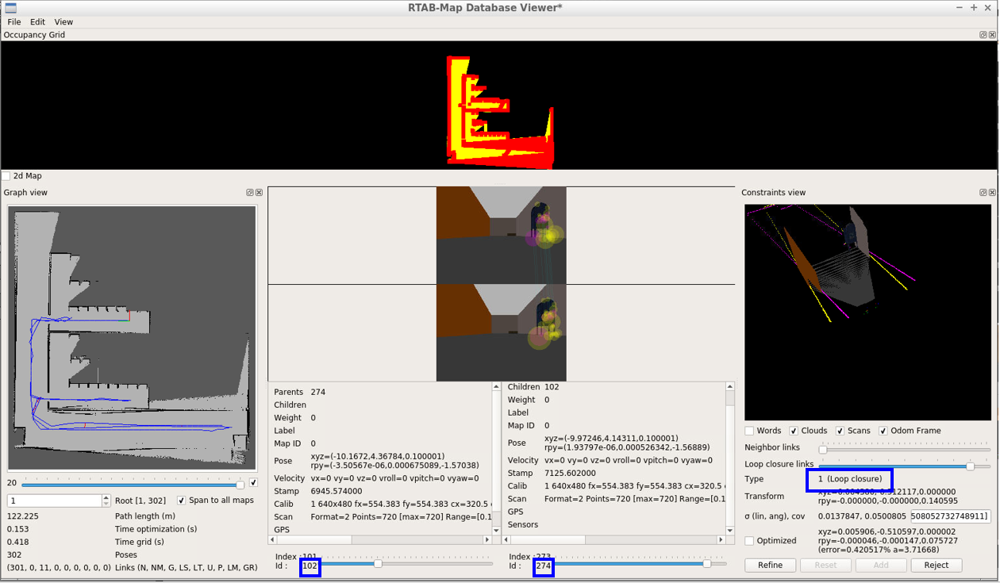

# RoboND-MapMyWorld

---

### Dependencies

- ROS Kinetic
- CMake 2.8
- unzip


### Installing ROS dependencies

```bash
$ cd <repo root>/catkin_ws
$ sudo apt update
$ rosdep install --from-paths ./src --ignore-packages-from-source -y
```

### Compiling the Program

```bash
$ cd <repo root>/catkin_ws
$ catkin_make
```

### Running `RTAB-Map` mapping

- To create the map file from scatch.

    ```bash
    $ cd <repo root>/catkin_ws/src
    $ sh rtab-mapping.sh
    ```

- In the `teleop_twist_keyboard` terminal, drive the robot according the path illustrated below:

    

### Load the pre-created `RTAB-Map` map

- To load the pre-created `RTAB-Map` map file

    ```bash
    $ cd <repo root>/catkin_ws/src/my_robot/rtabmap
    $ unzip rtabmap.db.zip
    ```

-  To view the outcome of `RTAB-Map` 

    ```bash
    $ cd <repo root>/catkin_ws/src/my_robot/rtabmap
    $ rtabmap-databaseViewer rtabmap.db
    ```
- Following image shows the number of global loop closure is `11`.

    

- Following image shows the two scenes (`102` and `274`) with **loop closure**. This is shown by `Type`= `1 (Loop closure)` in the `Constraints View` window.

    

- Following image shows the two scenes (`102` and `279`)  with **no loop closure**. This is shown in `Type`= `99 (Undefined)` in the `Constraints View` window.

    


### Running `RTAB-Map` localization

- Unzip the pre-created `RTAB-Map` map file

    ```bash
    $ cd <repo root>/catkin_ws/src/my_robot/rtabmap
    $ unzip rtabmap.db.zip
    ```

- Run the `rtab-localization` bash file

    ```bash
    $ cd <repo root>/catkin_ws/src
    $ sh rtab-localization.sh
    ```

- In the `teleop_twist_keyboard` terminal, drive the robot according the path illustrated below:

    

- The video demo below shows that the robot started off at the wrong location but managed to localize itself towards the end of path:

    

### Full Map

- The full mapping was completed with 10 `global loop closure`.

- `RTAB-Map` map file for the complete map can be downloaded from <a href="https://drive.google.com/file/d/1uVV7k56jAPAi10SXrlulJVV0_9opc8D6/view?usp=sharing">here</a>

- Below is the visualization of the full map of the simulation world.

    

    

    

- To generate `pgm` map file that can be used by other ROS localization packages such as <a href='https://wiki.ros.org/amcl'>AMCL</a>

    ``` bash
    $ rosrun map_server map_saver -f myMap
    ```
    

    Along with the `myMap.pgm` file, a config file `myMap.yaml` will also be generated.

    ``` {.line-numbers}
    image: myMap.pgm
    resolution: 0.050000
    origin: [-13.249369, -12.171536, 0.000000]
    negate: 0
    occupied_thresh: 0.65
    free_thresh: 0.196
    ```


### Reflections

- When performing `RTAB-Map` mapping in a world with repeated, similar scenes at different locations, we need to tweak the `RTAB-Map` param `Vis/MinInliers` to higher number, so that we don't mis-interpret the two visually similar places as the same loop closure point, and enforce a wrong contraint to the SLAM optimization problem.

- For the full mapping example in this repo, `Vis/MinInliers` of `35` was used.